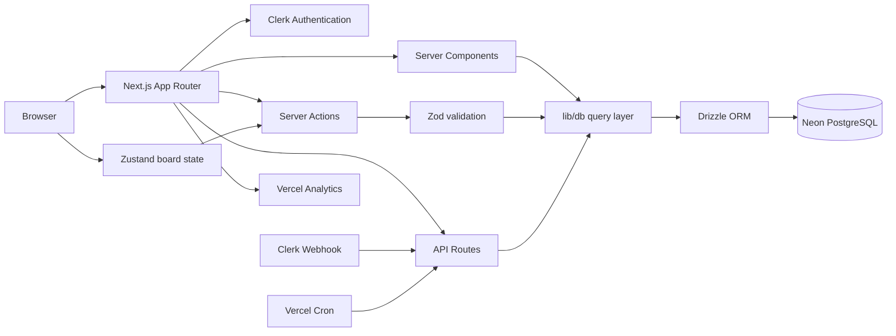
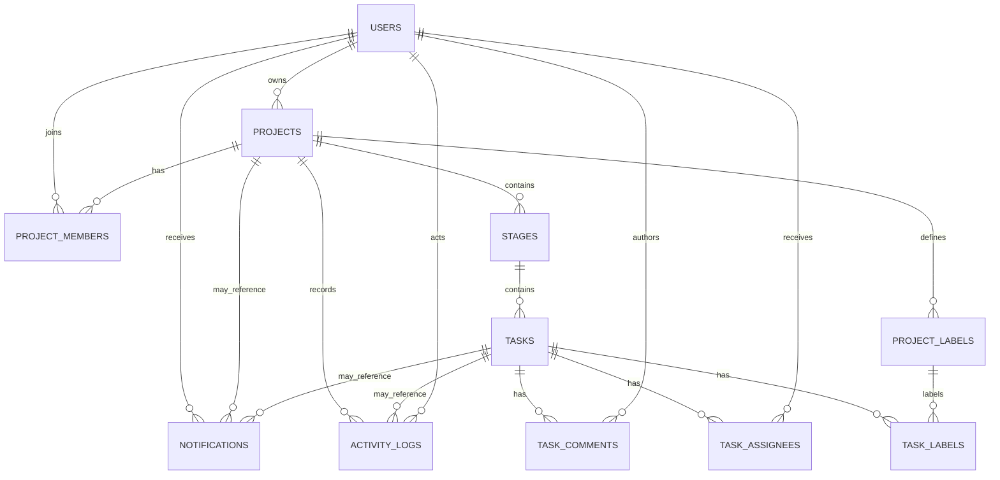

<div align="center">
  

  # Shiro

  **A focused, full-stack project management workspace built around Kanban, collaboration, deadlines, and measurable progress.**

  Next.js 16 · React 19 · TypeScript · Tailwind CSS 4 · Clerk · Drizzle ORM · Neon PostgreSQL · Zustand
</div>

---

## Overview

Shiro is a full-stack project management application for organizing projects, Kanban stages, tasks, collaborators, schedules, activity, notifications, and analytics in one workspace.

The application is built with the Next.js App Router and uses Server Components and Server Actions for most authenticated data workflows. Clerk handles authentication, Drizzle ORM provides the typed PostgreSQL data layer, Neon supplies the serverless PostgreSQL connection, and Zustand holds the client-side Kanban board state used during interactive board operations.

Shiro currently includes a public landing experience, custom Clerk authentication styling, an authenticated dashboard shell, project and task management, permission-aware collaboration, calendar planning, analytics, global search, notification preferences, scheduled deadline reminders, light/dark/system themes, keyboard navigation, and Vercel deployment configuration.

> Shiro began as an internship capstone project, but the current repository is a functional application rather than the original starter mockup.

---

## Table of contents

- [Features](#features)
- [Application areas](#application-areas)
- [Tech stack](#tech-stack)
- [Architecture](#architecture)
- [Roles and permissions](#roles-and-permissions)
- [Routing](#routing)
- [Database model](#database-model)
- [Authentication and user synchronization](#authentication-and-user-synchronization)
- [Notifications and scheduled reminders](#notifications-and-scheduled-reminders)
- [Keyboard shortcuts](#keyboard-shortcuts)
- [Getting started](#getting-started)
- [Environment variables](#environment-variables)
- [Database setup](#database-setup)
- [Development seed data](#development-seed-data)
- [Available scripts](#available-scripts)
- [Project structure](#project-structure)
- [Deployment](#deployment)
- [Responsive design](#responsive-design)
- [Accessibility and UX](#accessibility-and-ux)
- [Quality checks and testing](#quality-checks-and-testing)
- [Current limitations](#current-limitations)
- [Security notes](#security-notes)
- [License](#license)

---

## Features

### Projects

- Create, edit, complete/reactivate, and delete projects.
- Project name, description, color, start date, and due date.
- Project ownership and collaborator access roles.
- Project activity history.
- Project filtering by:
  - keyword;
  - access role;
  - status;
  - color;
  - schedule state.
- Project sorting by:
  - last activity;
  - creation date;
  - due date;
  - name;
  - color.

### Kanban boards

- Custom stages per project.
- Create, rename, reorder, and delete stages according to project permissions.
- Drag-and-drop task movement and ordering.
- Horizontal board navigation for multi-stage projects.
- Keyboard board navigation.
- Optimistic/client-side board state through Zustand with persistence through server actions.

### Tasks

- Create, edit, move, complete/reopen, archive/restore, and delete tasks.
- Task title and description.
- Priority levels:
  - Low
  - Medium
  - High
  - Urgent
- Optional start and due dates.
- Multiple assignees.
- Project-scoped labels.
- Comments and task activity timeline.
- Shareable task routes with slugged URLs.
- Intercepting route modal for task details when opened from a project board.
- Full-page task route fallback for direct navigation.

### Task filtering and bulk operations

Task filtering supports:

- title/description search;
- priority;
- project label;
- assignee;
- due-date state;
- completion state.

Due-date filters include:

- no due date;
- overdue;
- due today;
- due in the next 7 days;
- due in the next 30 days.

Bulk task operations include:

- completion/reopening;
- moving tasks between stages;
- setting priority;
- assigning and unassigning collaborators;
- adding and removing labels;
- archiving;
- deletion.

### Collaboration and team

- Project Owner, Member, and Viewer access levels.
- Add existing Shiro users to projects by email.
- Change collaborator roles.
- Remove collaborators from projects.
- Team directory showing people who share projects with the current user.
- Shared-project and assigned-task context in collaborator sidebars.
- Assignment candidates can include eligible collaborators from the user's wider Shiro team when the project owner is adding people to work.

### Dashboard

- Welcome state and first-project onboarding.
- Active project count.
- Assigned task count.
- Urgent task count.
- Current user's tasks.
- Recent project activity.
- Recent projects.

### Calendar

- Six-week month view.
- Project timeline mode for project start/due ranges.
- Due-date-only mode.
- Project filtering shared with project-list behavior.
- Month navigation and “Go to Today”.
- Project detail sheet with schedule, role, owner context, and current user's assigned tasks.

The calendar deliberately uses a horizontally scrollable wide grid on smaller viewports so multi-day project ranges remain readable.

### Analytics

- Filter by project or all accessible projects.
- Periods:
  - Last 7 days
  - Last 30 days
  - Last 90 days
  - Last 12 months
- Overview metrics:
  - completed tasks;
  - average completion time;
  - on-time completion rate;
  - active collaborators.
- Completion trend chart.
- Task health distribution.
- Open-task priority distribution.
- Project progress.
- Most active collaborators.

### Global search

- Authenticated project and task search.
- Accessible from the dashboard shell.
- `Cmd/Ctrl + K` focuses search.
- Search results link directly to projects and tasks.

### Notifications

Notification events currently include:

- project collaborator added;
- project collaborator removed;
- project collaborator role changed;
- task assigned;
- task unassigned;
- multiple tasks assigned;
- multiple tasks unassigned;
- task comment added;
- task due soon.

Users can mute all notifications or independently disable categories for:

- project access;
- assignments;
- comments;
- deadlines.

### Settings

- Profile name and job title.
- Avatar/account management through Clerk.
- Notification preferences.
- Account security shortcut to Clerk's account management UI.
- Light, dark, and system appearance modes.

### Public and authentication experience

- Shiro-branded public landing page.
- Product, Why Shiro, and Demo sections.
- Custom Shiro-like product illustration.
- Smooth anchor navigation.
- Sticky public navbar.
- Custom Clerk sign-in/sign-up appearance.
- Shiro-themed authentication background and decorative product artwork.

The Demo section currently contains a placeholder YouTube embed ID and should be updated before release.

---

## Application areas

| Area | Purpose |
|---|---|
| Landing | Public overview, product positioning, demo, sign-in/sign-up entry points |
| Dashboard | User-level overview of active work and recent activity |
| Projects | Search, filter, sort, create, and open projects |
| Project board | Kanban stages, tasks, filters, bulk operations, activity, archive, collaborators |
| Team | Cross-project collaborator directory |
| Analytics | Delivery, health, workload, and collaborator metrics |
| Calendar | Project timeline/due-date planning and assigned-task context |
| Settings | Profile, notifications, account security, theme preferences |
| Notifications | Project/task event feed and read state |
| Global search | Cross-project project/task retrieval |

---

## Tech stack

Versions below reflect the current lockfile rather than only the semver ranges in `package.json`.

### Application

| Technology | Current version | Role |
|---|---:|---|
| Next.js | 16.1.6 | App Router, Server Components, Server Actions, API routes |
| React | 19.2.4 | UI runtime |
| TypeScript | 5.9.3 | Static typing |
| Tailwind CSS | 4.3.3 | Styling and responsive design |
| Lucide React | 0.454.0 | Icon system |
| Radix UI | 1.6.7 | Accessible UI primitives |
| Sonner | 2.0.8 | Toast feedback |
| Recharts | 3.10.1 | Analytics charts |
| date-fns | 4.4.0 | Date utilities |

### Authentication and data

| Technology | Current version | Role |
|---|---:|---|
| Clerk | 7.6.3 | Authentication and account management |
| Drizzle ORM | 0.45.2 | Typed PostgreSQL schema and queries |
| Drizzle Kit | 0.31.10 | Migration generation and database tooling |
| Neon Serverless | 1.1.0 | PostgreSQL serverless driver |
| Zod | 4.4.3 | Server-side input validation |

### Interaction and state

| Technology | Current version | Role |
|---|---:|---|
| Zustand | 5.0.15 | Client-side Kanban board state |
| `@dnd-kit/react` | 0.5.0 | Drag-and-drop React integration |
| `@dnd-kit/dom` | 0.5.0 | Pointer/DOM drag-and-drop behavior |
| `@dnd-kit/abstract` | 0.5.0 | Drag-and-drop primitives |

### Tooling and deployment

| Technology | Role |
|---|---|
| pnpm | Package manager |
| Biome 2.5.6 | Linting and formatting |
| Vercel | Application deployment, Analytics, scheduled cron |
| GitHub Actions | Optional/manual Vercel deployment workflow |

---

## Architecture

Shiro follows a server-first Next.js architecture. Most reads happen in Server Components or database modules; mutations are implemented as Server Actions; a small number of HTTP endpoints are used for search, Clerk webhooks, and scheduled reminders.



### Main architectural conventions

- **Server Components by default.** Client components are used where browser state, effects, drag-and-drop, popovers, optimistic UI, or Clerk client APIs are required.
- **Server Actions for writes.** Project, stage, task, collaborator, label, comment, archive, bulk, settings, and notification mutations live under `lib/actions/`.
- **Database access isolated under `lib/db/`.** Route/page components do not embed SQL directly.
- **Authorization is server-side.** Project access is resolved before actions and data are exposed.
- **Zod validates user-controlled input.** Shared validation schemas live under `lib/validations/`.
- **Activity and notifications are side effects of domain mutations.** They are persisted rather than inferred only from UI state.
- **UTC date-only semantics are used for task/project scheduling logic where appropriate.**

---

## Roles and permissions

Shiro has three effective project access roles.

| Capability | Owner | Member | Viewer |
|---|:---:|:---:|:---:|
| View project | Yes | Yes | Yes |
| Edit project details | Yes | No | No |
| Complete/reactivate project | Yes | No | No |
| Delete project | Yes | No | No |
| Manage collaborators | Yes | No | No |
| Create/edit/delete/reorder stages | Yes | Yes | No |
| Create/edit/move/complete/archive/delete tasks | Yes | Yes | No |
| Assign/unassign tasks | Yes | Yes | No |

Internally, owners are represented by `projects.ownerId`; collaborator membership rows use the PostgreSQL enum values `member` and `viewer`.

Viewer access is intentionally read-only.

---

## Routing

### Public and authentication routes

| Route | Description |
|---|---|
| `/` | Public Shiro landing page |
| `/sign-in` | Clerk sign-in page in the Shiro auth shell |
| `/sign-up` | Clerk sign-up page in the Shiro auth shell |

### Authenticated application routes

| Route | Description |
|---|---|
| `/dashboard` | User dashboard |
| `/projects` | Project list, filtering, sorting, and creation |
| `/projects/[id]` | Project Kanban board |
| `/projects/[id]/tasks/[taskId]/[slug]` | Direct task-details route |
| `/team` | Team/collaborator directory |
| `/analytics` | Analytics dashboard |
| `/calendar` | Project calendar |
| `/settings` | User settings |

Task links opened from a project board also use an intercepting route under the `@taskModal` parallel route so task details can appear as a modal without losing board context.

### API routes

| Route | Method | Purpose |
|---|---|---|
| `/api/search?q=...` | GET | Authenticated global project/task search |
| `/api/webhooks/clerk` | POST | Clerk user-created/user-updated synchronization |
| `/api/cron/task-due-reminders` | GET | Authorized scheduled deadline-reminder generation |

---

## Database model

The schema lives in `lib/db/schema.ts` and is managed through Drizzle migrations under `drizzle/`.

### Tables

| Table | Purpose |
|---|---|
| `users` | Clerk-linked Shiro profile and notification preferences |
| `projects` | Project metadata, ownership, dates, color, completion |
| `project_labels` | Project-scoped reusable labels |
| `project_members` | Project collaborators and member/viewer roles |
| `stages` | Ordered Kanban columns |
| `tasks` | Ordered tasks, priority, schedule, completion/archive state |
| `task_assignees` | Many-to-many task assignments |
| `task_labels` | Many-to-many task/label relationship |
| `task_comments` | Task discussion |
| `activity_logs` | Immutable-ish project/task activity history |
| `notifications` | Recipient-specific notification feed and read state |

### Relationship overview



### Important schema behavior

- Project deletion cascades to project labels, memberships, stages, and related project-owned data.
- Stage deletion cascades to tasks in that stage.
- Task deletion cascades to assignments, labels, comments, and directly related notifications.
- Activity actor/task references can be set to `NULL` where historical context should survive actor/task deletion.
- Project labels are unique by normalized name within a project.
- Notifications can use `dedupeKey` with a recipient-level unique index to prevent duplicate scheduled/event notifications.

---

## Authentication and user synchronization

Clerk provides authentication and account-management UI.

Authenticated dashboard routes call `getCurrentDatabaseUser()`, which:

1. protects the request through Clerk;
2. looks up the corresponding Shiro user by Clerk ID;
3. if the Shiro row is missing, loads the Clerk profile and upserts it into PostgreSQL.

Shiro also exposes `/api/webhooks/clerk`. The webhook currently responds to:

- `user.created`
- `user.updated`

and synchronizes:

- Clerk user ID;
- primary email;
- first/last-name-derived display name;
- image URL.

### Clerk webhook setup

In Clerk Dashboard, create a webhook endpoint pointing to:

```text
https://YOUR_DOMAIN/api/webhooks/clerk
```

Subscribe at minimum to:

```text
user.created
user.updated
```

Store the webhook signing secret in:

```env
CLERK_WEBHOOK_SIGNING_SECRET=...
```

For local webhook development, expose the Next.js server through a tunnel and point the Clerk development endpoint to the tunneled `/api/webhooks/clerk` URL.

---

## Notifications and scheduled reminders

Notification creation is centralized through the notification service and database layer.

### Categories

| Category | Events |
|---|---|
| Project access | collaborator added/removed/role changed |
| Assignments | task(s) assigned/unassigned |
| Comments | new task comment |
| Deadlines | task due soon |

The notification center stores read state and exposes “mark all read”. User preferences are persisted in the `users` table.

### Due-date cron

`vercel.json` schedules:

```json
{
  "path": "/api/cron/task-due-reminders",
  "schedule": "5 0 * * *"
}
```

That means the endpoint is scheduled once per day at **00:05 UTC**.

The endpoint requires:

```http
Authorization: Bearer <CRON_SECRET>
```

It checks task assignments due during the current UTC calendar day and creates deduplicated `task_due_soon` notifications.

Manual local test:

```bash
curl \
  -H "Authorization: Bearer $CRON_SECRET" \
  http://localhost:3000/api/cron/task-due-reminders
```

Typical response:

```json
{
  "checked": 0,
  "created": 0
}
```

`checked` is the number of eligible assignments found for the current UTC date; `created` is the number of reminder notifications actually inserted.

---

## Keyboard shortcuts

Keyboard shortcuts are enabled throughout the authenticated dashboard, with board-specific commands when a project board is active.

### General

| Shortcut | Action |
|---|---|
| `Cmd/Ctrl + K` | Focus global search |
| `Cmd/Ctrl + B` | Collapse/expand desktop sidebar |
| `?` | Open keyboard-shortcut help |

### Navigation

Navigation shortcuts are two-key sequences. Press `G`, then the destination key within the sequence timeout.

| Shortcut | Destination |
|---|---|
| `G D` | Dashboard |
| `G P` | Projects |
| `G T` | Team |
| `G A` | Analytics |
| `G C` | Calendar |
| `G S` | Settings |

### Projects

| Shortcut | Action |
|---|---|
| `N` | Create a project while on `/projects` |
| `Cmd/Ctrl + /` | Focus the active Projects/Board filter input |

### Project board

| Shortcut | Action |
|---|---|
| `H` or `←` | Previous stage |
| `L` or `→` | Next stage |
| `J` or `↓` | Next task |
| `K` or `↑` | Previous task |
| `Enter` | Open focused task |
| `S` | Enter/leave selection mode |
| `Space` | Select/deselect focused task |
| `A` | Archive selected tasks |
| `Backspace` / `Delete` | Delete selected tasks |
| `Esc` | Exit selection mode or clear board focus |

Keyboard handlers intentionally avoid hijacking shortcuts while the user is typing in editable controls or while a blocking overlay is open.

---

## Getting started

### Prerequisites

- **Node.js 20.9+**. The deployment workflow currently uses Node 20, and Clerk's installed package requires Node 20.9 or later.
- **pnpm 10**.
- A **Clerk** application.
- A PostgreSQL database. The current data layer is configured for **Neon Serverless PostgreSQL**.
- Git.

### 1. Clone the repository

```bash
git clone https://github.com/KuriGohan1992/shirogane-project-management.git
cd shirogane-project-management
```

### 2. Install dependencies

```bash
pnpm install
```

### 3. Create the local environment file

```bash
cp .env.example .env.local
```

Then fill in the required values described below.

### 4. Apply database migrations

```bash
pnpm db:migrate
```

To inspect migration/schema consistency first:

```bash
pnpm db:check
```

### 5. Configure the Clerk webhook

Create the `/api/webhooks/clerk` endpoint in your Clerk Dashboard and add its signing secret to `.env.local`.

### 6. Optional: seed development data

After the account you want to use has been synchronized into Shiro:

```env
SEED_USER_EMAIL=you@example.com
```

Then run:

```bash
pnpm db:seed
```

### 7. Start development

```bash
pnpm dev
```

Open:

```text
http://localhost:3000
```

---

## Environment variables

Create `.env.local` from `.env.example`.

### Required for the application

| Variable | Purpose |
|---|---|
| `NEXT_PUBLIC_CLERK_PUBLISHABLE_KEY` | Public Clerk frontend key |
| `CLERK_SECRET_KEY` | Clerk server key |
| `CLERK_WEBHOOK_SIGNING_SECRET` | Verifies Clerk webhook requests |
| `DATABASE_URL` | PostgreSQL/Neon connection string |
| `CRON_SECRET` | Authorizes the due-reminder cron endpoint |

### Clerk routing configuration

The current project example uses:

```env
NEXT_PUBLIC_CLERK_SIGN_IN_URL=/sign-in
NEXT_PUBLIC_CLERK_SIGN_UP_URL=/sign-up
NEXT_PUBLIC_CLERK_AFTER_SIGN_IN_URL=/dashboard
NEXT_PUBLIC_CLERK_AFTER_SIGN_UP_URL=/dashboard
```

Keep the values aligned with your Clerk application configuration and deployed URLs.

### Seed-only variables

| Variable | Required? | Purpose |
|---|---|---|
| `SEED_USER_EMAIL` | Required for `pnpm db:seed` | Selects the existing Shiro user who will own/use generated seed data |
| `ALLOW_PRODUCTION_SEED` | No | Must equal `true` to deliberately allow seeding when `NODE_ENV=production` |

### Suggested `.env.local` template

```env
# Clerk
NEXT_PUBLIC_CLERK_PUBLISHABLE_KEY=pk_test_...
CLERK_SECRET_KEY=sk_test_...
CLERK_WEBHOOK_SIGNING_SECRET=whsec_...

NEXT_PUBLIC_CLERK_SIGN_IN_URL=/sign-in
NEXT_PUBLIC_CLERK_SIGN_UP_URL=/sign-up
NEXT_PUBLIC_CLERK_AFTER_SIGN_IN_URL=/dashboard
NEXT_PUBLIC_CLERK_AFTER_SIGN_UP_URL=/dashboard

# Database
DATABASE_URL=postgresql://...

# Scheduled notifications
CRON_SECRET=replace_with_a_long_random_secret

# Development seed
SEED_USER_EMAIL=you@example.com
# ALLOW_PRODUCTION_SEED=true
```

> The current repository's `.env.example` should be updated to add `CLERK_WEBHOOK_SIGNING_SECRET` and the seed variables so it stays in sync with the implementation.

Never commit `.env.local` or production secrets.

---

## Database setup

Drizzle configuration is defined in `drizzle.config.ts`:

- schema: `./lib/db/schema.ts`
- migrations: `./drizzle`
- dialect: PostgreSQL
- connection: `DATABASE_URL`

### Generate a migration after schema changes

```bash
pnpm db:generate
```

Review the generated SQL before applying it.

### Apply migrations

```bash
pnpm db:migrate
```

### Validate migration/schema consistency

```bash
pnpm db:check
```

### Open Drizzle Studio

```bash
pnpm db:studio
```

---

## Development seed data

The seed script is:

```text
scripts/seed.ts
```

It creates deterministic development data so repeated local work produces a predictable project/task dataset rather than completely random records.

Required:

```env
DATABASE_URL=...
SEED_USER_EMAIL=an-existing-shiro-user@example.com
```

Run:

```bash
pnpm db:seed
```

### Production protection

The seed script refuses to run when:

```text
NODE_ENV=production
```

unless this is explicitly set:

```env
ALLOW_PRODUCTION_SEED=true
```

Do not enable that override casually.

---

## Available scripts

| Command | Description |
|---|---|
| `pnpm dev` | Start the Next.js development server |
| `pnpm build` | Create a production Next.js build |
| `pnpm start` | Run the production Next.js server |
| `pnpm type-check` | Run TypeScript without emitting files |
| `pnpm lint` | Run Biome linting |
| `pnpm format` | Format files with Biome |
| `pnpm check` | Run Biome checks |
| `pnpm check:write` | Apply Biome safe/writeable fixes |
| `pnpm db:generate` | Generate Drizzle migrations |
| `pnpm db:migrate` | Apply Drizzle migrations |
| `pnpm db:studio` | Open Drizzle Studio |
| `pnpm db:check` | Validate Drizzle migration/schema state |
| `pnpm db:seed` | Seed deterministic development data |

Recommended pre-commit verification:

```bash
pnpm type-check
pnpm check
```

Recommended release/deployment verification:

```bash
pnpm type-check
pnpm check
pnpm build
```

---

## Project structure

```text
shirogane-project-management/
├── .github/
│   └── workflows/
│       └── deploy.yml              # Optional/manual Vercel deployment workflow
├── app/
│   ├── (auth)/
│   │   ├── sign-in/               # Clerk sign-in route
│   │   └── sign-up/               # Clerk sign-up route
│   ├── (dashboard)/
│   │   ├── analytics/              # Analytics page + loading/error state
│   │   ├── calendar/               # Calendar page + loading state
│   │   ├── dashboard/              # Main dashboard
│   │   ├── projects/               # Projects, board, task routes/modal
│   │   ├── settings/               # User settings
│   │   ├── team/                   # Team directory
│   │   └── layout.tsx              # Authenticated DashboardShell
│   ├── api/
│   │   ├── cron/task-due-reminders/
│   │   ├── search/
│   │   └── webhooks/clerk/
│   ├── globals.css                 # Tailwind + Shiro theme tokens
│   ├── layout.tsx                  # Clerk, theme, toaster, analytics
│   └── page.tsx                    # Public landing page
├── components/
│   ├── analytics/                  # Analytics panels/charts/filters
│   ├── auth/                       # Auth-page shell/decorative UI
│   ├── calendar/                   # Calendar timeline and sidebars
│   ├── landing/                    # Landing brand and product art
│   ├── modals/                     # Create/edit/member/task modal flows
│   ├── settings/                   # Profile/notification/security/theme UI
│   ├── team/                       # Team directory cards/sidebar
│   ├── ui/                         # Shared Radix/shadcn-style primitives
│   ├── dashboard-shell.tsx
│   ├── kanban-board.tsx
│   ├── project-*.tsx
│   ├── stage-*.tsx
│   └── task-*.tsx
├── hooks/
│   ├── use-field-errors.ts
│   └── use-project-filters.ts
├── lib/
│   ├── actions/                    # Server-side mutations
│   ├── auth/                       # Current-user + permission logic
│   ├── board/                      # Board helper logic
│   ├── constants/                  # Roles, activity, limits, notifications
│   ├── db/                         # Typed database queries and schema
│   ├── services/                   # Cross-domain services (notifications)
│   ├── validations/                # Zod validation
│   └── *.ts                        # Filtering, dates, analytics, utilities
├── stores/
│   ├── board-store.ts              # Active Zustand board state
│   └── ui-store.ts                 # Legacy/unused placeholder; candidate for cleanup
├── types/                          # Shared application/domain types
├── drizzle/                        # SQL migrations and metadata
├── scripts/
│   └── seed.ts                     # Deterministic development seed
├── public/                         # Shiro logo/static assets
├── proxy.ts                        # Clerk middleware/proxy configuration
├── .env.example                    # Environment variable template
├── .gitignore
├── biome.json
├── components.json
├── drizzle.config.ts
├── next.config.mjs
├── package.json
├── pnpm-lock.yaml
├── pnpm-workspace.yaml
├── postcss.config.mjs
├── tsconfig.json
└── vercel.json
```

### Generated/ignored directories

- `.next/` — Next.js build/development output.
- `dist/` — may be generated by external tooling such as the Liam ERD export; ignored by Git and Biome and not required to run Shiro.
- `.vercel/` — local Vercel project metadata.

---

## Deployment

Shiro is configured with Vercel in mind.

### Vercel application setup

1. Import the repository into Vercel. The application now lives at the repository root, so leave Vercel's **Root Directory** at the repository root rather than `project`.
2. Configure all production environment variables.
3. Ensure the production PostgreSQL/Neon database has current migrations.
4. Configure the production Clerk webhook:

```text
https://YOUR_PRODUCTION_DOMAIN/api/webhooks/clerk
```

5. Ensure `CRON_SECRET` is configured in Vercel.
6. Deploy.

### Scheduled reminders

`vercel.json` includes the daily due-reminder cron at 00:05 UTC. Vercel should invoke the route with the configured cron authorization behavior; keep the route secret protected.

### GitHub Actions

`.github/workflows/deploy.yml` includes a Vercel deployment workflow.

Automatic push/pull-request triggers are currently commented out. The workflow remains available through `workflow_dispatch` and supports a `preview` or `production` target.

The workflow performs:

1. checkout;
2. Node setup;
3. pnpm installation;
4. dependency installation;
5. TypeScript check;
6. Biome lint;
7. Vercel CLI installation;
8. Vercel environment pull;
9. Vercel build;
10. prebuilt deployment.

At minimum, configure the `VERCEL_TOKEN` repository secret expected by the current workflow. If your CI environment cannot infer/link the Vercel project non-interactively, also configure project/org identifiers or adjust the workflow to your Vercel setup.

---

## Responsive design

Shiro uses Tailwind's mobile-first breakpoints with several deliberate application-specific strategies:

- authenticated sidebar becomes an off-canvas drawer below `lg`;
- Projects and Team grids collapse from three columns to one;
- forms switch from multi-column to stacked fields;
- task-details comments move below the main task content before `lg`;
- Kanban preserves its multi-stage interaction through horizontal scrolling;
- the calendar preserves its seven-column timeline through horizontal scrolling;
- shared dialogs are constrained to the viewport;
- authentication background decorations disappear on smaller screens;
- internal scroll areas use the `.scrollbar-thin` utility while the document-level scrollbar is visually hidden.

A dedicated mobile hardening review identified a smaller set of remaining issues around dense project-header controls, collaborator management, fixed-height dashboard cards, bulk task actions, fixed-width popovers, analytics controls, and several loading-state layouts. These are part of the final responsive-polish pass.

---

## Accessibility and UX

The current codebase includes several accessibility-oriented patterns:

- semantic buttons/links rather than click-only containers for primary interactions;
- `aria-label` on icon-only actions;
- `aria-current` for active dashboard navigation;
- `aria-expanded` and `aria-controls` on sidebar collapse controls;
- focus-visible rings across interactive elements;
- screen-reader-only dialog titles/descriptions where visual headings are custom;
- explicit button `type` values;
- form validation feedback and `aria-invalid`/`aria-describedby` wiring;
- keyboard navigation and shortcut suppression while editing text;
- accessible dialog/sheet/popover primitives through Radix UI;
- reduced visual ambiguity through permission-aware disabled/read-only interfaces.

Continue validating keyboard focus order, color contrast, screen-reader naming, and touch target size when adding new UI.

---

## Quality checks and testing

### Static quality tooling

- TypeScript strict/static checking through `pnpm type-check`.
- Biome linting/formatting.
- Drizzle schema/migration validation.
- Next.js production build as the final integration check.

### Automated tests

There is **no automated unit, integration, or end-to-end test suite configured in the current repository**. There is no `test` script in `package.json` and no Playwright/Jest/Vitest test setup in the current source tree.

Until automated tests are added, use a deliberate manual regression pass for:

- owner/member/viewer permissions;
- project CRUD and completion;
- task CRUD, DnD, completion, archive, bulk actions;
- label and assignee management;
- comments/activity;
- filters and query-string behavior;
- notification generation/read state/preferences;
- calendar timeline and due-only mode;
- analytics period/project filters;
- theme switching;
- keyboard shortcuts;
- mobile widths and touch interaction;
- direct task URLs and intercepting task modal routes.

---

## Current limitations

The following are intentionally documented so the README reflects the repository as it exists today rather than claiming features that are not implemented.

- No automated test suite is currently configured.
- No WebSocket/presence layer or true real-time multi-user cursor/state synchronization is implemented. Collaboration is persisted through normal server/database requests.
- No file-attachment system is implemented for tasks/comments.
- The landing-page Demo iframe still uses `YOUR_VIDEO_ID` until a final Shiro walkthrough is uploaded.
- Deadline reminders are currently generated by a once-daily UTC cron rather than minute-level scheduling.
- Some dense mobile layouts still require a final responsive-hardening pass.
- `components/header.tsx`, `components/footer.tsx`, and `stores/ui-store.ts` appear to be legacy starter/unused files and are candidates for cleanup after confirming no external imports.
- The repository's current `.env.example` is behind the implementation and should be updated with webhook and seed variables.

---

## Security notes

- Never commit `.env.local` or secret keys.
- Keep `CLERK_SECRET_KEY`, `CLERK_WEBHOOK_SIGNING_SECRET`, `DATABASE_URL`, and `CRON_SECRET` server-only.
- Project permission checks must remain on the server; hiding a UI control is not authorization.
- Validate IDs and form payloads before database writes.
- Clerk webhook requests must be verified before processing.
- Keep the cron endpoint protected by a sufficiently long random secret.
- Review generated migrations before applying them to production.
- The seed script has a production guard; do not bypass it unless intentional.

---

## Design system notes

Shiro uses a custom light/dark token system in `app/globals.css`.

### Brand

- Primary Shiro blue: `#2563EB` in light mode.
- Dark mode keeps the brand identity while using a darker interaction blue for large selected/primary surfaces.
- Font: Manrope.
- Cards, borders, muted states, board stages, and task surfaces are tokenized rather than hard-coded per component.

The UI favors:

- tonal layering;
- restrained shadows;
- blue branded section/stage headers;
- compact metadata;
- rounded but relatively structured surfaces;
- consistent hover/focus feedback;
- light and dark theme parity.

---

## Development conventions

Recommended conventions for continued Shiro development:

- Prefer Server Components unless browser-only behavior is required.
- Keep mutations in `lib/actions/` and database operations in `lib/db/`.
- Reuse shared validation schemas rather than validating ad hoc in components.
- Preserve permission checks in server code even when the client UI already hides controls.
- Keep loading skeletons structurally aligned with the real responsive component.
- Use viewport-aware popover widths such as:

```tsx
w-[min(20rem,calc(100vw-2rem))]
```

rather than unconditional `w-80` for mobile-facing controls.
- Keep comments in production code short and purpose-focused.
- Use Conventional Commit-style messages for repository history.

---

## License

No license file is included in the current repository. Add an explicit license before distributing or accepting third-party contributions under defined reuse terms.

---

<div align="center">
  <strong>Shiro</strong><br />
  Project management without the clutter.
</div>
